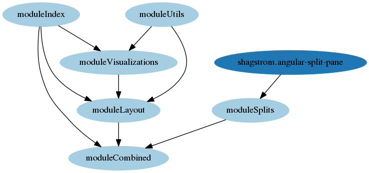

# Architecture
An overview is shown in the following graph:

We create all needed elements with Angular. D3.js job's is just to fill them with visualization svgs and dynamic property values related to the specific visualization. This way, we define the DOM layout all at once in the same places.

### Layout
We use two controllers: One for the top main panel, another for layout directives. Children directives sometimes need to call each others functions. Since we can't rely on the parent-child hierarchy to call these functions, an object in the controller holds all the functions of a given directive to be shared. These objects are prefixed with "API" and the name of the directive. This way, directive's scope doesn't creep to the controller except what we want to share.

Many elements are compiled manually, therefore we need to clean them ourselves. We do this by creating a new scope for a given element with compiled html, attaching corresponding functions to this scope. It will be destroyed later on, alongside with the html. As a result, we don't leave detached DOM elements with active Angular handlers, which would be called for already deleted nodes.

### Visualizations
Holds common functionality used by each specific visualization.

# Notes

### Documentation
Complex methods or objects are documented with JSDoc style comments.

### Style Guides
https://github.com/mgechev/angularjs-style-guide

### Development Stack
- ECMAScript version 6
- Angular 1
- NPM

### WebDev Tips
To force modified files to refresh, disable your browser's cache (for example, in Chrome, it is possible to disable cache while DevTools is open).
