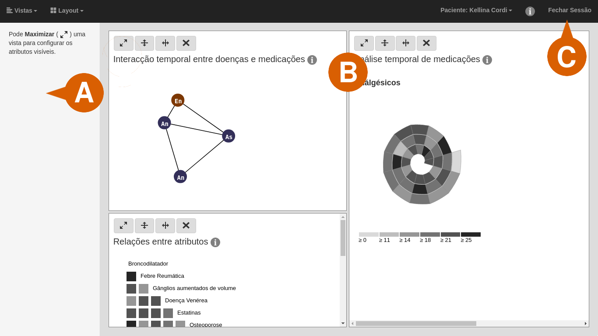
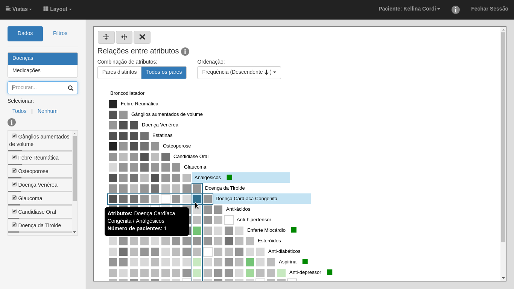
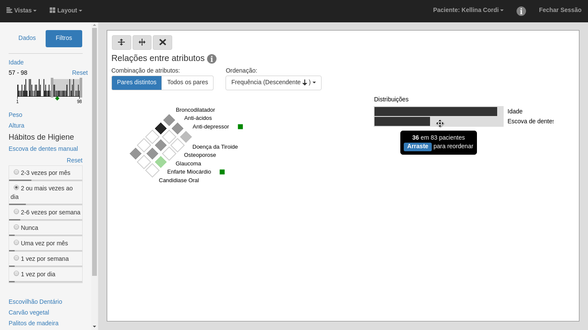
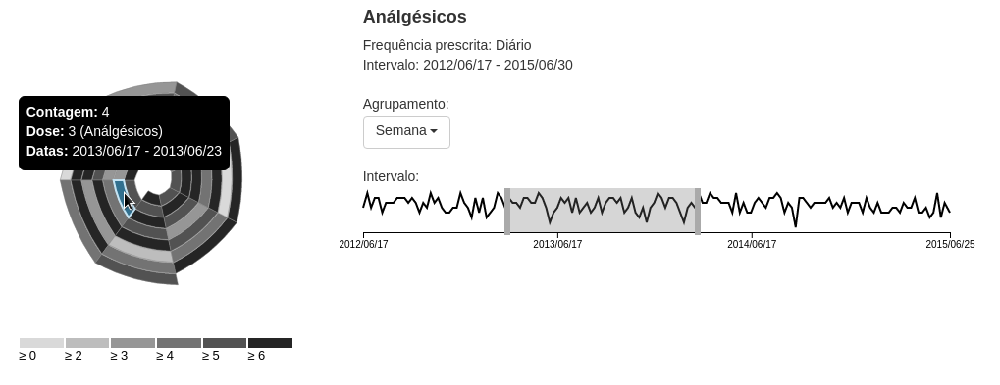
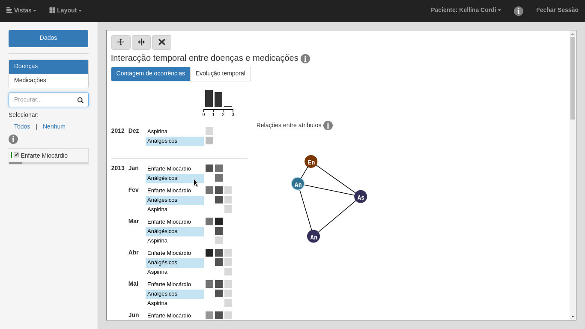
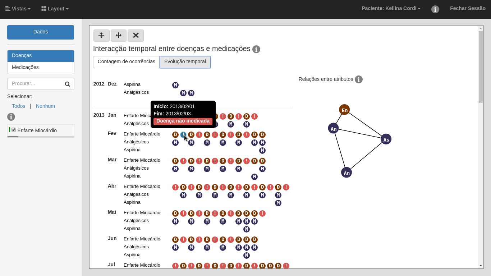

# MultiViz

Web interface with linked visualizations of multi-dimensional data. Source code accompanying my master thesis.

## Dependencies

For running:
```
npm install
```

For compiling documentation:
```
npm install markdown-pdf
plantuml
```

## Running

Generate data with `data/templates/build.sh`.

Start a local web server, for example:

```bash
python -m http.server 8888
# or
python -m SimpleHTTPServer 8888
```

Open `index.html` with Google Chrome browser.

## Documentation

For further development, see `docs/HACKING.pdf`.

Compile it with `docs/build.sh`.

## Gallery


<p align="center">Layout of the interface: ActionPanel (A), Panes (B), MainPanel (C).</p>

---


<p align="center">Co-Occurance matrix, arranged for all pairs of attribute categories.</p>

---


<p align="center">Co-Occurance matrix, arranged for distinct pairs of attribute categories. The ActionPanel contains user set values, while the PatientDistributions Icicle Plot shows the hierarchical application of filters.</p>

---


<p align="center">Spiral visualization. User applies brushing to the time interval, reducing the number of sectors displayed.</p>

---


<p align="center">Heatmap with summarized frequencies of attribute occurrences.</p>

---


<p align="center">Timelines for time periods between attribute occurrences.</p>
