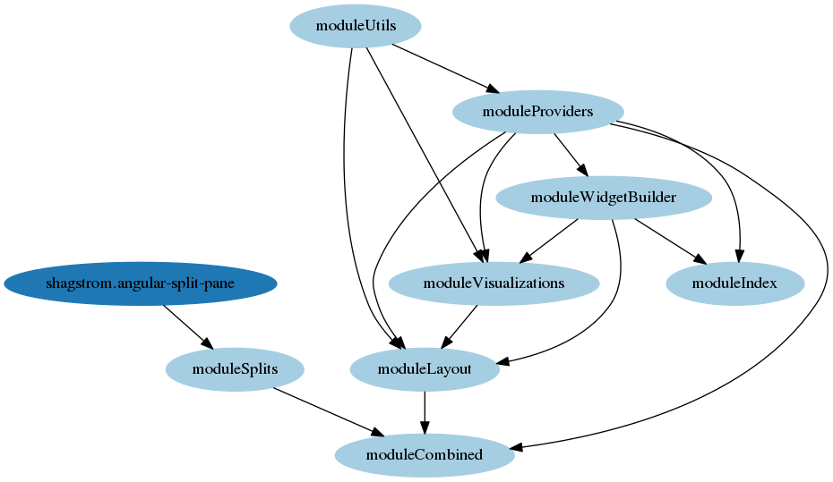
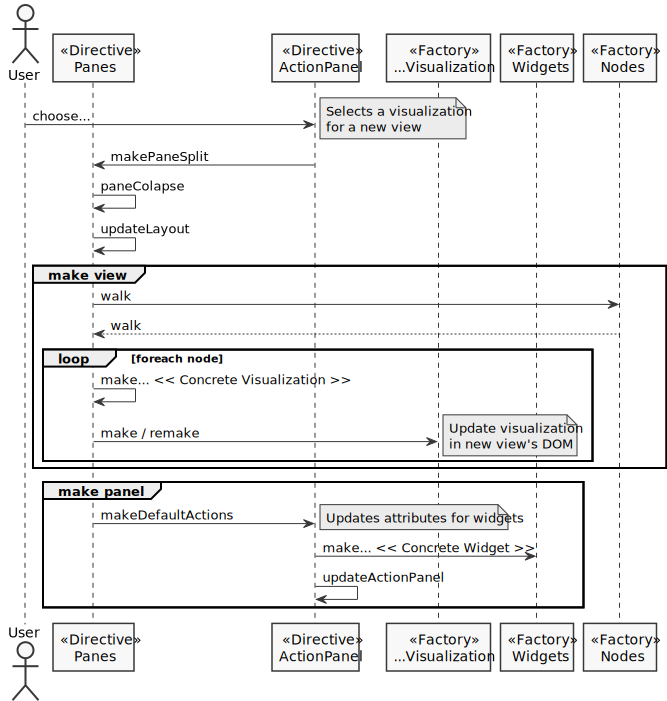
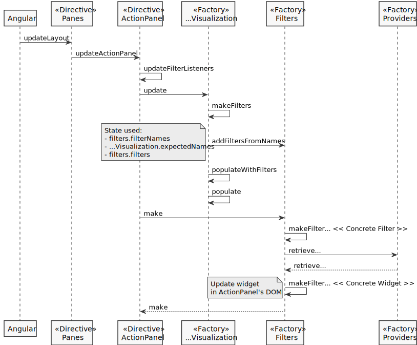
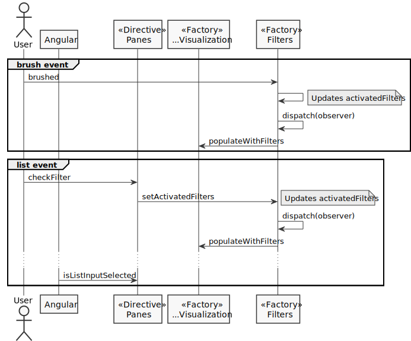
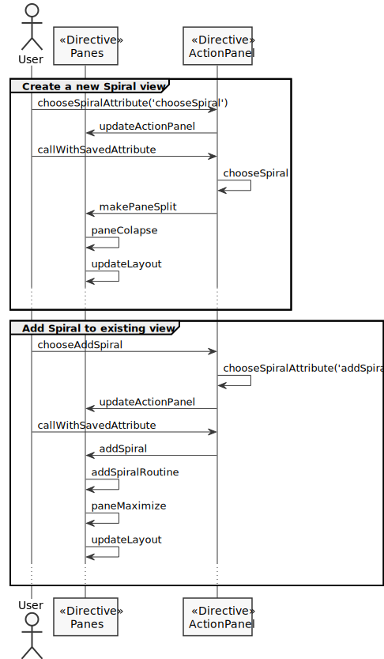

# Architecture
An overview of our Angular modules' hierarchy is shown in the following graph:

We have two pages, each with it's corresponding "main" module: `moduleIndex` and `moduleLayout`.

### Layout
We use two controllers: One for the top main panel, another for layout directives.

Children directives sometimes need to call each others functions. Since we can't rely on the parent-child hierarchy to call these functions, an object in the controller holds all the functions of a given directive to be shared. These objects are prefixed with "API" and the name of the directive. This way, directive's scope doesn't creep to the controller except what we want to share.

Many elements are compiled manually, therefore we need to clean them ourselves. We do this by creating a new scope for a given element with compiled html, attaching corresponding functions to this scope. It will be destroyed later on, alongside with the html. As a result, we don't leave detached DOM elements with active Angular handlers, which would be called for already deleted nodes.

We create all needed elements with Angular. D3.js job's is just to fill them with visualization svgs and dynamic property values related to the specific visualization. This way, we define the DOM layout all at once in the same places.

The following diagram describes how layout updates are carried out. We split method calls by the two major elements in the interface: the `Panes` (`make view`) and the `Action Panel` (`make panel`).

### Visualizations
Holds common functionality used by each concrete visualization. These are implemented in different factories, where state is tracked and methods for data extraction and rendering exist. Most of the layout and listeners are defined in the `Panes` directive.

### Heatmap
This is the only view where filters are implemented.

The following diagram describes the process of creating filters: Data needs to be extracted, elements need to be added to the `Action Panel`, and handlers are defined for user interaction with the corresponding widgets.

The following diagram describes how updates are carried out when the user interacts with a given filter. Two different widgets are implemented: `brushes` and `lists`.

### Spiral
This is the only view that supports multiple visualizations. There are two different ways in which a spiral is created: Either when the view itself is created, or when the user adds an additional spiral. The following diagram shows the control flow of each case.

### Timeline
Needs refactoring. There's considerable slowdown when making elements, since we are simply removing and appending them to the DOM, instead of using merges.

# Notes

### Documentation
Complex methods or objects are documented with JSDoc style comments.

### Style Guides
- https://github.com/mgechev/angularjs-style-guide

### Development Stack
- ECMAScript version 6
- Angular 1
- NPM

### WebDev Tips
To force modified files to refresh, disable your browser's cache (for example, in Chrome, it is possible to disable cache while DevTools is open).
